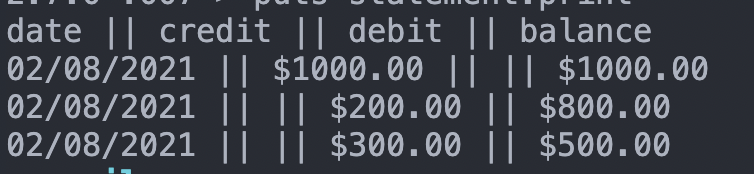
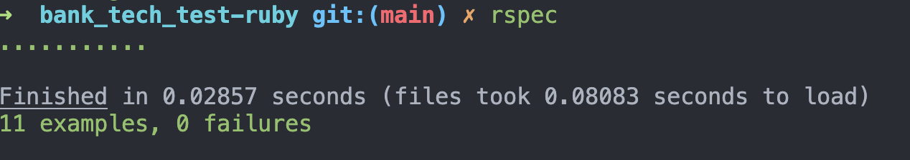

# Bank Tech Test

Interactive command line banking application. Can create a bank account, deposit funds, withdraw funds and print an account statement.

## user stories

```
As a banking customer,
So that I can start banking
I would like to be able to open an account with $0
```
```
As a banking customer,
So that I can have money when I need it
I would like to be able to withdraw money from my account
```
```
As a banking customer,
So that I can keep my money safe
I would like to be able to deposit money into my account
```
```
As a banking customer,
So that I can keep track of my spending and saving
I would like to be able to view my statement
```
```
As a banking customer,
So that I am not taking out an overdraft
I would like to be notified if I withdraw over my balance
```
```
As a banking customer,
So that I am not taking out the correct amount
I would like to be notified if I try to withdraw an amount less than £0
```
```
As a banking customer,
So that I am depositing the correct amount 
I would like to be notified if I try to deposit an amount less than £0
```
## Approach

The way I have approached this task is by declaring user stories and writing 2 classes, described below. I have structured the code this way in order to follw the single resposibility principle and the keep the code from being repeated(DRY)

## classes and methods

#### BankAccount 

-INITIALIZE
transactions history
initial balance

-DEPOSIT

-WITHDRAW


#### BankStatement

INITIALIZE(transaction history)

PRINT

## How to use

Clone this repo and move into the project directory.
```
$ git clone https://github.com/Lundi19/bank_tech_test-ruby.git
$ cd bank_tech_test-ruby
$ bundle install
```
start IRB
```
irb
```
in IRB, require statement.rb, the response should be true
```
require  "./lib/statement.rb"
```
initialize a new account
```
2.7.0 :003 > bank = BankAccount.new
```
make some deposits and withdrawls
```
2.7.0 :003 > bank.deposit(1000)
2.7.0 :003 > bank.withdraw(200)
2.7.0 :003 > bank.withdraw(400)
```
initialize a statement with those transactions
```
2.7.0 :003 > statement = Statement.new(bank.transactions)
2.7.0 :003 > puts statement.print
```
print to the terminal



## Testing

For the tests run Rspec
```
$ rspec
```




 
and for linting

```
$ rubocop
```


